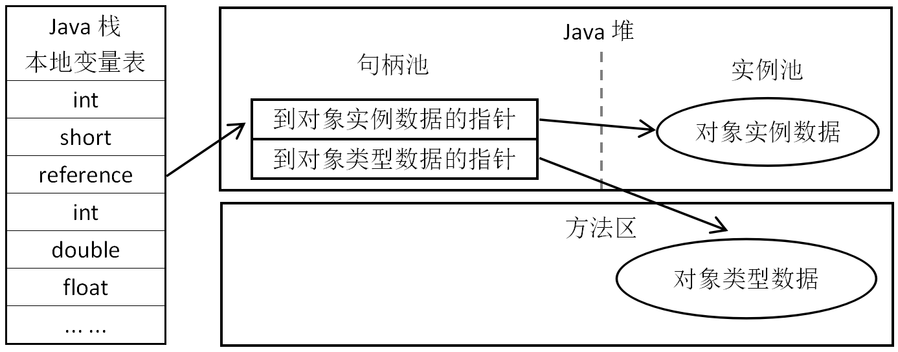
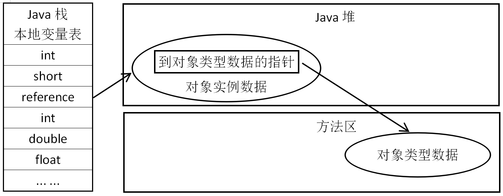
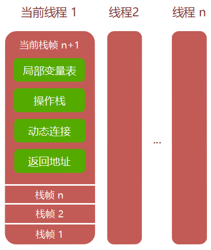

##### 线程私有的数据区

- 程序计数器
  - 程序计数器是一块较小的内存空间, 它的作用可以看做是当前线程所指向的字节码的行号指示器。在虚拟机的概念模型里，字节码解释器工作时就是通过改变这个计数器的值来选取下一条需要指向字节码指令，分支、循环、跳转、异常处理、线程恢复等基础功能都需要依赖这个计数器来完成
  - 由于 Java 虚拟机的多线程是通过线程轮流切换并分配处理器指向时间的方式来实现的，在任何一个确定的时刻，一个处理器（对于多核处理器来说是一个内核）只会执行一条线程的指令。因此，为了线程切换后能恢复到正确的执行位置，每条线程都需要有一个独立的程序计数器，各条线程之间的计数器互不影响，独立存储，我们称这类内存区域为“线程私有”的内存。
  - 如果线程正在执行的是一个 Java 的方法, 这个计数器记录的是正在执行的虚拟机字节码指令的地址. 如果正在执行的是 Native 方法，这个计数器值则为空（Undefined）。此内存区域是唯一一个在 Java 虚拟机规范中没有任何 OutOfMemoryError 情况的区域。

- 虚拟机栈
  - 与程序计数器一样，Java 虚拟机栈也是线程私有的，它的生命周期与线程相同。
  - 每个方法被执行的时候都会同时创建一个栈帧（Stack Frame，栈帧是方法运行期的基础数据结构）用于存储局部变量表、操作栈、动态链接、方法出口等信息。每一个方法被调用直至执行完成的过程，就对应着一个栈帧在虚拟机栈栈从入栈到出栈的过程。
  - 当执行 Java 方法是会进行压栈的操作，在栈栈会保存局部变量、操作栈和方法出口等信息。JVM 规定了栈的最大深度，如果线程请求执行方法时栈的深度大于规定的深度，就会抛出栈溢出异常 StockOverflowError
  - 如果虚拟机在扩展时无法申请到足够的内存，就会抛出内存溢出异常 OutOfMemoryError
- 本地方法栈
  - 本地方法栈与虚拟机栈的区别是虚拟机栈为 Java 服务，而本地方法栈为 native 方法服务。
  - 与虚拟机栈一样，本地方法栈也会抛出 StackOverflowError 和 OutOfMemoryError 异常。

##### 所有线程共享的数据区域

- Java 堆 (Java Heap)

  - 对于大多数应用来说, 堆是 Java 虚拟机所管理的内存中最大的一块
  - 堆是被所有线程共享的一块内存区域，在虚拟机启动时创建。
  - 此内存区域的唯一目的就是存放对象的实例，几乎所有的对象实例都在这里分配内存。
  - 堆是垃圾收集器管理的主要区域

- 方法区

  - 方法区存储的是已经被虚拟机加载的数据

  - 各个线程共享的内存区域，它用于存储已经被虚拟机加载的等数据. 存储类的信息, 常量, 静态变量, 即时编译器编译后的代码等

  - 方法区的大小决定履历系统可以保存多少个类，如果系统定义了太多的类，导致方法区溢出，虚拟机同样抛出内存溢出异常 OutOfMemoryError

  - 分为运行时常量池和直接内存两部分

    - 运行常量池 (Running Constant Pool)

      ```
      是方法区的一部分
      Class 文件中除了有类的 版本、字段、方法和接口等描述信息，还有一项信息就是常量池 (Constant Pool Table)
      常量池用于存放编译期生成的各种字面量和符号引用, 这部分内容将在类加载后进入方法区的运行时常量池中存放
      受到方法区内存的限制, 当常量池无法再申请到内存时就会抛出 OutOfMemoryError 异常
      ```

    - 直接内存

      ```
      1. 直接内存不是虚拟机运行时数据区的一部分，也不是 Java 虚拟机规范中定义的内存区域。
      2. 直接分配: 在 JDL1.4 中新加入的  NIO（New Input/Output）类，引入了一种基于通道（Channel）与缓冲区（Buffer）的 I/O 方式，它可以使用 native 函数库直接分配堆外内存，然后通过一个存储在 Java 堆中的 DirectByteBuffer 对象作为这块内存的引用操作，这样能避免在 Java 堆和 native 堆中来回复制数据。
      3. 直接内存的分配不会受到 Java 堆大小的限制，但是会受到设备总内存（RAM 以及 SWAP 区）大小以及处理器寻址空间的限制。
      4. 直接内存的容量默认与 Java 堆的最大值一样，如果超额申请内存，也可能导致 OOM 异常
      ```

##### 对象访问

```java
// "Object obj" 在栈的本地变量表中, 作为一个引用类型数据出现
// "new Object()" 在堆中存储实例化的对象, 类型不同这块内存的长度是不同. 堆还必须包含能查找到此对象类型数据（如对象类型、父类、实现的接口、方法等）的地址信息，这些类型数据则存储在方法区中
Object obj = new Object();
```

对于引用类型不同虚拟机对访问方式会有所不同, 主流的访问方法有两种: 使用句柄和直接指针

- 句柄访问方式: 堆中将会划分出一块内存作为句柄池, 引用对象存储的就是对象的句柄地址, 句柄中包含了对象实例数据和类型数据各自的具体地址信息

  

- 指针访问方式: 堆对象的布局中就必须考虑如何放置访问类型数据的相关信息，引用对象直接存储的就是对象地址

  

- 对比

  - 使用句柄访问方式的最大好处就是引用对象中存储的是稳定的句柄地址，在对象被移动（垃圾收集时移动对象是非常普遍的行为）时只会改变句柄中的实例数据指针，而引用对象本身不需要被修改
  - 使用直接指针访问方式的最大好处就是速度更快，它节省了一次指针定位的时间开销，由于对象的访问在 Java 中非常频繁，因此这类开销积少成多也是一项非常可观的执行成本

##### 栈帧



局部变量表 (Local Variable Table) 中的变量只在当前函数调用中有效, 当函数调用结束后，随着函数栈帧的销毁，局部变量表也会随之销毁。

- 基本数据类型
- 对象引用: 可能是一个执行对象起始地址的引用指针，也可能是指向一个代表对象的句柄或其他与此对象相关的位置
- returnAddress: 指向了一条字节码指令的地址

操作数栈 (Operand Stack) 也叫操作栈, 它主要用于保存计算过程的中间结果, 同时作为计算过程中临时变量的存储空间

- 先进后出的数据结构, 只支持入栈和出栈两种操作
- 当一个方法刚开执行时，操作数是空的，在方法执行的过程中，会有各种字节码执行往操作数栈中写入和提取内容，也就是出栈/入栈操作。
- 当调用了虚拟机额 iadd 指令后，它就会在操作数栈弹出两个整数并进行加法计算，并将计算结果入栈。

添加动态字段: 每个栈帧都包含一个指向运行时常量池中该栈帧所属非法的引用，持有这个引用是为了支持方法调用过程中的动态连接（Dynamic Linking）

方法返回地址: 当一个方法开始执行后，只有两种方式可以退出这个方法，一种是正常调用完成，另一种是异常调用完成

- 


```
方法返回地址
当一个方法开始执行后，只有两种方式可以退出这个方法，一种是正常调用完成，另一种是异常调用完成。
① 正常调用完成
执行引擎遇到任意一个方法返回的字节码指令，这时候可能会有返回值传递给上层方法调用者。
是否有返回值和返回值的类型将根据遇到哪种方法返回指令来决定，这种退出方法的方式成为正常调用完成（Normal Method Invocation Completion）

② 异常调用完成 
在方法执行过程中遇到异常，并且这个异常没有在方法体内得到处理，就会导致方法退出，这种退出方式成为异常调用完成（Abrupt Method Invocation Completion）
一个方法使用异常调用完成 的方法退出，任何值都不会返回给它的调用者。
无论采用哪种退出方式，在方法退出后，都需要返回到方法被调用的位置，程序才能继续执行。


```

