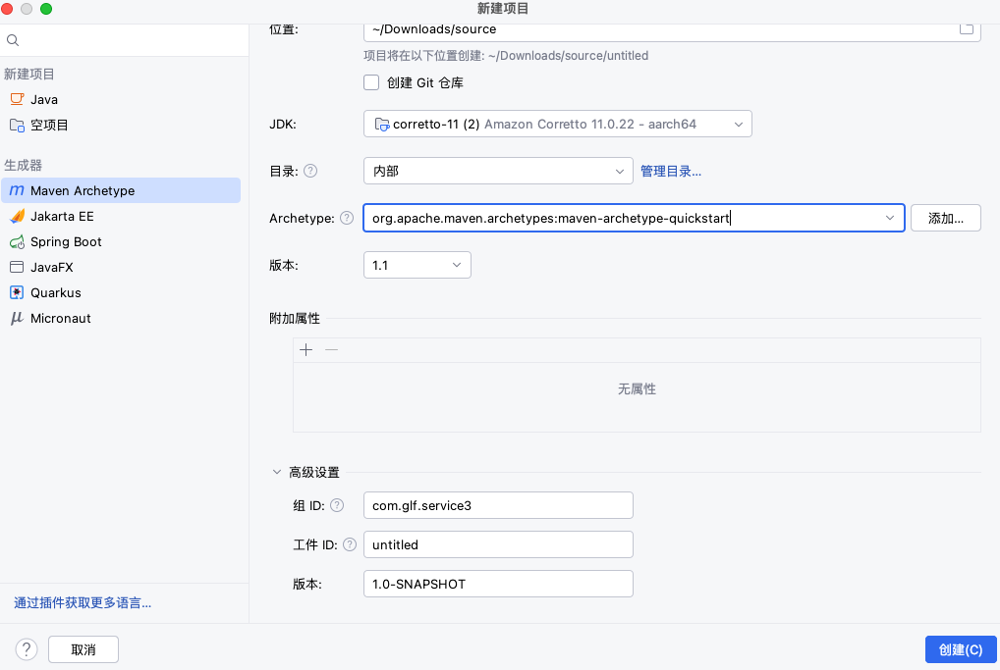

##### 参考

[官网](https://maven.apache.org/download.cgi)

https://www.cnblogs.com/pengpengdeyuan/p/14217772.html
https://www.runoob.com/maven/maven-pom.html

##### 安装

- windows

  ```bash
  1. 安装到 \opt 目录下
  
  2. 添加系统变量
  M2_HOME C:\opt\apache-maven-3.8.2
  MAVEN_HOME C:\opt\apache-maven-3.8.2
  
  3. 添加 PATH 变量
  %M2_HOME%\bin
  %MAVEN_HOME%\bin
  ```

- linux

  ```bash
  1. 下载: apache-maven-3.8.2-bin.zip
  
  2. 文件拷贝到 /opt 
  
  3. 编辑 ~/.zshrc 添加
  vim ~/.zshrc
  export M2_HOME=/opt/apache-maven-3.8.2
  export PATH=$PATH:$M2_HOME/bin
  
  4. 重启
  $ source ~/.zshrc
  ```

- mac

  ```bash
  $ sdk install maven 3.9.6
  ```

##### 配置

配置文件目录

```bash
用户配置优先于全局配置
# 全局配置
$ ${maven.home}/conf/settings.xml
# 用户配置
$ ${user.home}/.m2/settings.xml
```

```xml
<!-- 本地仓库路径-->
<localRepository>D:\opt\mavenRepository</localRepository>

<!-- 远程源-->
<mirror>  
		<id>alimaven</id>  
		<name>aliyun maven</name>  
		<url>http://maven.aliyun.com/nexus/content/groups/public/</url>
		<mirrorOf>central</mirrorOf>          
</mirror>
```

##### IDEA 创建 maven 项目

Archetype 是 Maven 工程的模板工具包, 帮助用户创建 Maven 工程模板

```
maven-archetype-archetype			一个样例原型
maven-archetype-j2ee-simple		简单的J2EE应用程序样例
maven-archetype-mojo					Maven插件样本的示例
maven-archetype-plugin				Maven插件样本
maven-archetype-plugin-site		Maven插件网站的样例
maven-archetype-portlet				JSR-268门户样例
maven-archetype-quickstart		Maven工程样例
maven-archetype-simple				一个简单的Maven工程
maven-archetype-site					Maven网站的样例，它演示了对诸如APT、XDoc和FML等文档类型的支持，并演示了如果把网站国际化（i18n）
maven-archetype-site-simple		Maven网站样例
maven-archetype-webapp				Maven的Webapp工程样例
```



##### 命令

```bash
$ mvn --help
maven 命令的格式为 mvn [plugin-name]:[goal-name]
  -D 指定参数，如 -Dmaven.test.skip=true 跳过单元测试
  -P 指定 Profile 配置，可以用于区分环境
  -e 显示maven运行出错的信息
  -o 离线执行命令,即不去远程仓库更新包
  -X 显示maven允许的debug信息
  -U 强制去远程更新 snapshot 的插件或依赖, 默认每天只更新一次
# ---------------------------------------- 参数
-Dmaven.test.skip=true 										# 跳过测试
-Dmaven.tomcat.port=9090 									# 指定端口
-Dmaven.test.failure.ignore=true 					# 忽略测试失败

$ mvn -v													# 查看 mvn 的版本及配置信息
$ mvn -version 
$ mvn -X													# 查看 mvn 的配置
$ mvn -e 													# 显示详细错误信息
$ mvn clean												# 清理项目
$ mvn plugin:goal									# 运行 Maven 插件目标
$ mvn idea:idea										# 生成 IDEA 项目文件
$ mvn eclipse:eclipse							# 生成 Eclipse 项目文件
$ mvn eclipse:clean 							# 清除eclipse的一些系统设置

# ---------------------------------------- 创建项目
# 构建java项目
$ mvn archetype:create -DgroupId=packageName -DartifactId=projectName
# 创建web项目
$ mvn archetype:create -DgroupId=com.glfadd -DartifactId=springboottemplate -DarchetypeArtifactId=maven-archetype-webapp

# ---------------------------------------- 运行测试
$ mvn test												# 编译并测试
$ mvn test -skipping compile -skipping test-compile # 只测试不编译也不编译测试

# ---------------------------------------- 编译
$ mvn compile											# 将.java类编译为.class文件
$ mvn test-compile 								# 编译测试代码
# ---------------------------------------- 
$ mvn site												# 生成应用程序的文档。包括：代码规范、覆盖率等
# ---------------------------------------- 打包
$ mvn package 										# 打包项目生成jar/war文件
$ mvn -Dtest package 							# 只打包不测试
$ mvn jar:jar 										# 只打jar包
$ mvn source:jar 									# 打包源码
$ mvn deploy 											# 上传到远程仓库

$ mvn install											# 安装jar至本地库
$ mvn install -X 									# 查看完整的依赖踪迹，打开 mvn 的调试标记运行
$ mvn install assembly:assembly		# 构建装配Maven Assembly
$ mvn install -DskipTests					# 跳过测试构建项目
$ mvn install -U									# 强制检查更新
$ mvn dependency:analyze 					# 查看依赖的工具
$ mvn dependency:tree							# 列出项目依赖
$ mvn dependency:resolve 					# 打印已解决依赖的列表
$ mvn dependency:tree com.xx.xxx 	# 看到依赖树 
$ mvn dependency:list 						# 查看已解析依赖
$ mvn dependency:sources 					# 下载依赖库的源代码

$ mvn help:describe -Dplugin=help # 输出Maven Help插件的信息
$ mvn help:describe -Dplugin=help -Dfull 													# 输出完整的带有参数的目标列
$ mvn help:describe -Dplugin=compiler -Dmojo=compile -Dfull 			# 获取单个目标的信息
$ mvn help:describe -Dplugin=exec -Dfull 													# 列出所有Maven Exec插件可用的目标
$ mvn help:effective-settings			# 查看 mvn 的配置
$ mvn help:effective-pom 					# 查看 mvn 的默认设置
$ mvn help:system 								# 从中央仓库下载文件至本地仓库 
$ mvn help:active-profiles 				# 查看当前激活的profiles 
$ mvn help:all-profiles 					# 查看所有profiles 
$ mvn help:effective -pom 				# 查看完整的pom信息

# ---------------------------------------- 运行
$ mvn tomcat:run 									# 运行项目于tomcat上
$ mvn tomcat:deploy								# 运行打包部署
$ mvn tomcat:undeploy							# 撤销部署
$ mvn tomcat:start								# 启动web应用
$ mvn tomcat:stop									# 停止web应用
$ mvn tomcat:redeploy							# 重新部署
$ mvn war:exploded tomcat:exploded# 部署展开的war文件
$ mvn archetype:generate					# 创建 Maven 项目
$ mvn jetty:run 									# 运行项目于jetty上

# ---------------------------------------- 验证
$ mvn validate 										# 验证工程是否正确，所有需要的资源是否可用
$ mvn integration-test 						# 在集成测试可以运行的环境中处理和发布包
$ mvn verify 											# 运行任何检查，验证包是否有效且达到质量标准
$ mvn generate-sources 						# 产生应用需要的任何额外的源代码
```

### 项目打包

```
打包的机制
如pom,jar, maven-plugin, ejb, war, ear, rar, par，默认为 jar

<packaging>war</packaging>
```


##### Maven 的三种打包方式

```
1. pom 是 maven 依赖文件
可以作为其他项目的maven依赖，用来做jar包的版本控制。

2. jar 是 java 普通项目打包文件
通常是开发时需要应用的类，当需要某些功能时就导入相应的jar包；以zip包的形式供调用（用命令java -jar xxx.jar执行）。

3. war 常用于 java web 项目工程
用来发布服务，打成war包后部署到服务器访问。可以用zip包的形式使用（java -jar xxx.war执行，前提是配置了main函数入口），也可以用解压缩的形式使用(通常情况下是解压后的war包)。
```


##### maven 打包

- 修改该 pom.xml 添加

  ```xml
  <project>
      <packaging>jar</packaging>
  
      <build>
          <plugins>
              <plugin>
                  <groupId>org.springframework.boot</groupId>
                  <artifactId>spring-boot-maven-plugin</artifactId>
              </plugin>
          </plugins>
      </build>
  </project>
  
  ```

- 打包

  ```bash
  $ mvn clean package
  
  # 在 target 目录下生成两个jar文件
  # springboot-exec-jar-1.0-SNAPSHOT.jar.original是Maven标准打包插件打的jar包，它只包含我们自己的Class，不包含依赖
  # springboot-exec-jar-1.0-SNAPSHOT.jar是Spring Boot打包插件创建的包含依赖的jar，可以直接运行
  ├── classes
  ├── generated-sources
  ├── maven-archiver
  ├── maven-status
  ├── projecttime-1.0-SNAPSHOT.jar
  └── projecttime-1.0-SNAPSHOT.jar.original
  ```

- 运行

  ```bash
  $ java -jar projecttime-1.0-SNAPSHOT.jar
  
  # 指定运行的内存
  $ nohup java -Xmx1000m -Xms1000m -jar ./target/projecttime-1.0-SNAPSHOT.jar > /dev/null 2>&1 &
  $ nohup java -Xmx500m -Xms500m -jar ./target/projecttime-1.0-SNAPSHOT.jar > /dev/null 2>&1 &
  
  # --server.port 等价于在 application.properties 中添加属性 server.port=8888
  $ nohup java -Xmx1000m -Xms1000m -jar ./target/projecttime-1.0-SNAPSHOT.jar --server.port=11309 > /dev/null 2>&1 &
  ```

##### spring-boot-maven-plugin

```
作用: spring-boot-maven-plugin 是将项目依赖的 jar包打包进 jar 或者 war 当中.


打包
$ mvn package spring-boot:repackage


1. 如果没有添加 maven 插件, 导致没把依赖的包打进去, 通过命令 java -jar springboot-0.0.1-SNAPSHOT.jar 启动程序失败.
2. 添加 maven 插件重新clear，install，打包正常19M. 通过命令 java -jar springboot-0.0.1-SNAPSHOT.jar 可以正常启动项目.

解压后文件夹:
  BOOT-INF: 存放的该项目编译后的class文件，和依赖的jar包。
  META-INF: 存放了项目的依赖jar包关系。
  org: 存放了springboot相关的一些class文件。
```


### 常见错误

##### 创建项目报错

```
$ mvn archetype:create -DgroupId=com.glfadd -DartifactId=springboottemplate -DarchetypeArtifactId=maven-archetype-webapp
[ERROR] Error executing Maven.
[ERROR] 1 problem was encountered while building the effective settings
[FATAL] Non-parseable settings C:\opt\apache-maven-3.8.2\conf\settings.xml: TEXT must be immediately followed by END_TAG and not STARTTART_TAG seen ...alRepository>C:\opt\apache-maven-3.8.2\maven-repo<localRepository>... @55:73)  @ C:\opt\apache-maven-3.8.2\conf\setti column 73
```

##### 打包报错

```
[ERROR] Failed to execute goal org.apache.maven.plugins:maven-compiler-plugin:3.8.1:compile (default-compile) on project projecttime: Fatal error compiling: invalid target release: 11 -> [Help 1]
[ERROR] 
[ERROR] To see the full stack trace of the errors, re-run Maven with the -e switch.
[ERROR] Re-run Maven using the -X switch to enable full debug logging.
[ERROR] 
[ERROR] For more information about the errors and possible solutions, please read the following articles:
[ERROR] [Help 1] http://cwiki.apache.org/confluence/display/MAVEN/MojoExecutionException


原因
pom.xml 和 当前环境 java 的版本不一致
```

##### 


```
 $ mvn compile
[INFO] Scanning for projects...
[INFO] 
[INFO] ---------------------< com.glf.service3:service-3 >---------------------
[INFO] Building service-3 1.0-SNAPSHOT
[INFO] --------------------------------[ jar ]---------------------------------
[INFO] 
[INFO] --- maven-resources-plugin:2.6:resources (default-resources) @ service-3 ---
[INFO] Using 'UTF-8' encoding to copy filtered resources.
[INFO] skip non existing resourceDirectory /Users/glfadd/Downloads/source/service-3/src/main/resources
[INFO] 
[INFO] --- maven-compiler-plugin:3.1:compile (default-compile) @ service-3 ---
[INFO] Changes detected - recompiling the module!
[INFO] Compiling 1 source file to /Users/glfadd/Downloads/source/service-3/target/classes
[INFO] -------------------------------------------------------------
[ERROR] COMPILATION ERROR : 
[INFO] -------------------------------------------------------------
[ERROR] 不再支持源选项 5。请使用 7 或更高版本。
[ERROR] 不再支持目标选项 5。请使用 7 或更高版本。
[INFO] 2 errors 
[INFO] -------------------------------------------------------------
[INFO] ------------------------------------------------------------------------
[INFO] BUILD FAILURE
[INFO] ------------------------------------------------------------------------
[INFO] Total time:  0.331 s
[INFO] Finished at: 2024-08-13T15:03:07+08:00
[INFO] ------------------------------------------------------------------------
[ERROR] Failed to execute goal org.apache.maven.plugins:maven-compiler-plugin:3.1:compile (default-compile) on project service-3: Compilation failure: Compilation failure: 
[ERROR] 不再支持源选项 5。请使用 7 或更高版本。
[ERROR] 不再支持目标选项 5。请使用 7 或更高版本。
[ERROR] -> [Help 1]
[ERROR] 
[ERROR] To see the full stack trace of the errors, re-run Maven with the -e switch.
[ERROR] Re-run Maven using the -X switch to enable full debug logging.
[ERROR] 
[ERROR] For more information about the errors and possible solutions, please read the following articles:
[ERROR] [Help 1] http://cwiki.apache.org/confluence/display/MAVEN/MojoFailureException


解决办法:
    <properties>
        <project.build.sourceEncoding>UTF-8</project.build.sourceEncoding>
        <java.version>11</java.version>
        <maven.compiler.source>11</maven.compiler.source>
        <maven.compiler.target>11</maven.compiler.target>
        <maven.compiler.compilerVersion>11</maven.compiler.compilerVersion>
    </properties>
```


##### mvn clean

```
[WARNING] 
[WARNING] Some problems were encountered while building the effective model for com.glf.service3:service-3:jar:1.0-SNAPSHOT
[WARNING] 'build.plugins.plugin.version' for org.springframework.boot:spring-boot-maven-plugin is missing. @ line 89, column 21
[WARNING] 
[WARNING] It is highly recommended to fix these problems because they threaten the stability of your build.
[WARNING] 
[WARNING] For this reason, future Maven versions might no longer support building such malformed projects.
[WARNING] 


解决办法:
<parent>
  <groupId>org.springframework.boot</groupId>
  <artifactId>spring-boot-starter-parent</artifactId>
  <version>3.3.2</version>
  <relativePath/>
</parent>
```


