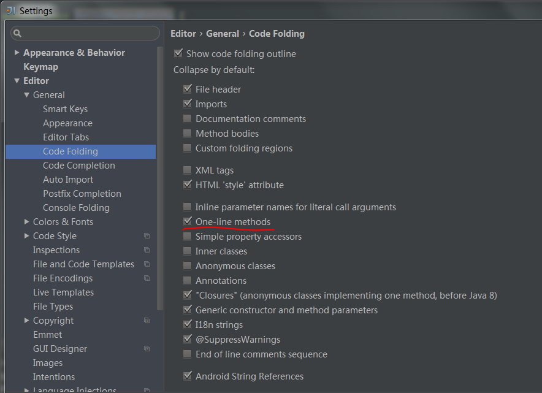
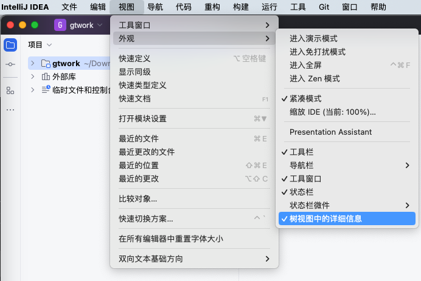
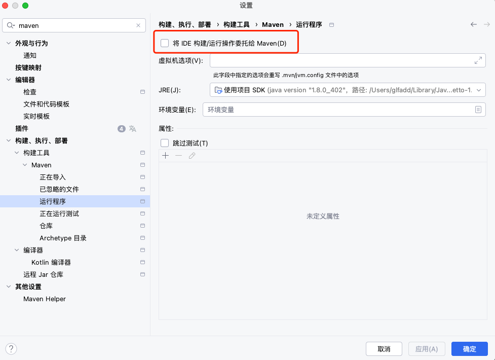
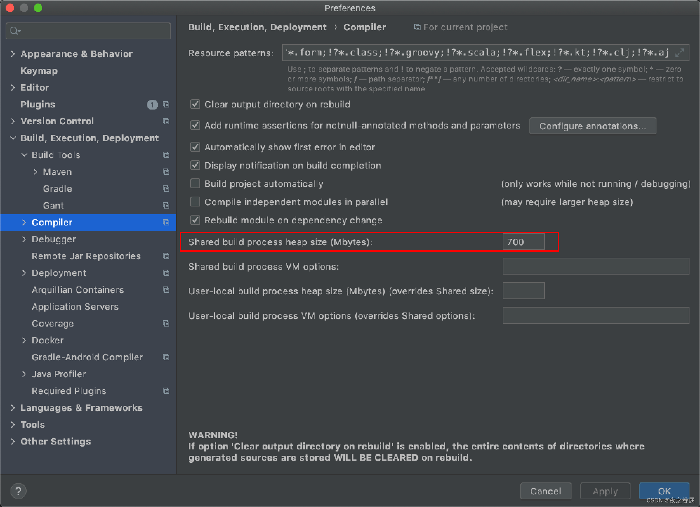
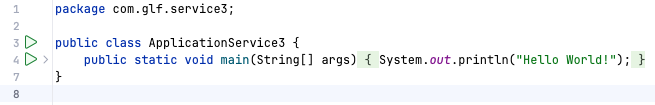
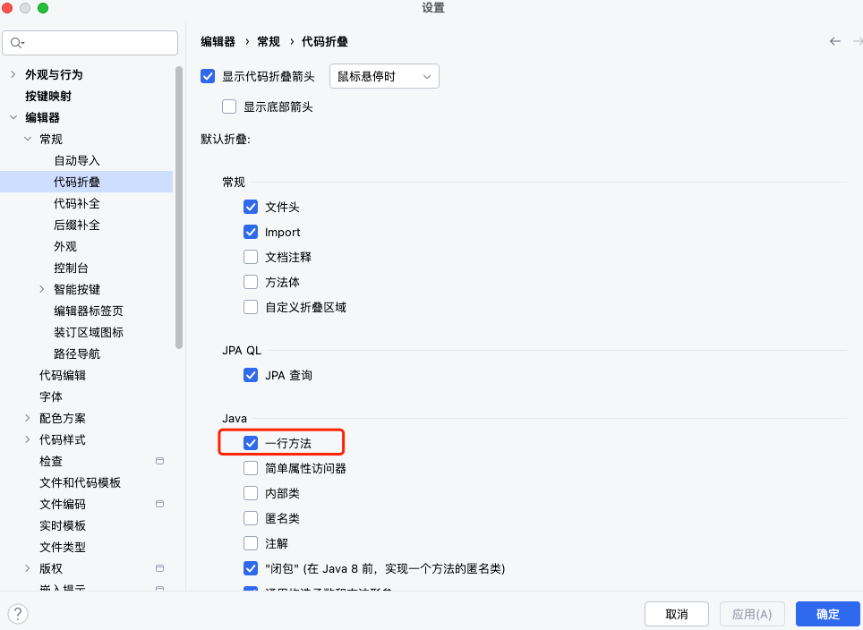
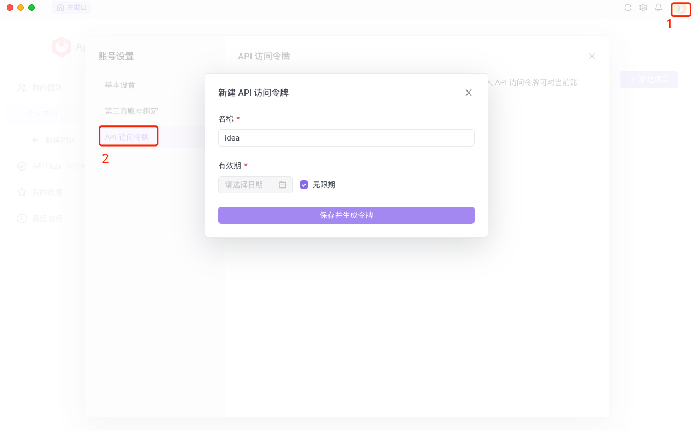

[TOC]

### 设置

```
-Xms512m 设置初时的内存大小，提高Java程序的启动速度
-Xmx750m 设置最大内存数，提高该值，可以减少内存Garage收集的频率，提高程序性能。
-Xverify：none 关闭Java字节码验证，从而加快了类装入的速度，并使得在仅为验证目的 而启动的过程中无需装入类，缩短了启动时间
-XX:+UseParNewGC 使用并行收集算法
-server 控制内存garage方式，这样你无需在花一到两分钟等待内存garage的收集
-Dsun.awt.keepWorkingSetOnMinimize=true 可以让IDEA最小化到任务栏时依然保持以占有的内存，当你重新回到IDEA，能够被快速显示，而不是由灰白的界面逐渐显现整个界面，加快回复到原界面的速度。
关键参数：

-XX:ReservedCodeCacheSize 保留代码占用的内存容量参数

```

##### 编译速度慢

```
buidl 速度慢, 修改
Shared build process heap size (Mbytes):
```

##### 更换启动图片

```
lib 文件夹下面打开 app.jar 文件, 替换 idea_logo.png 和 idea_logo@2x.png 
```

##### 关闭代码自动折叠



##### debug 时直接返回

```
https://blog.csdn.net/qq_35472880/article/details/102911213

https://blog.csdn.net/qq_34033853/article/details/123710220
```


```
com + F9	手动构建(Build Project)
(Rebuild Project)
```

##### 文件树



##### 结束进程


##### 编译



编译内存



##### 






```
```


### 插件

##### SequenceDiagram Core

序图和类图

```
https://juejin.cn/post/7134877521182457869
https://blog.csdn.net/qq_35030548/article/details/132092597


系统自带的
https://www.cnblogs.com/aaaazzzz/p/14018313.html
https://blog.csdn.net/weixin_45393094/article/details/126795316 (详细)
```

##### PlantUML Integration

思维导图

```
https://juejin.cn/post/7017988314053492767
https://cloud.tencent.com/developer/article/1798803
https://blog.csdn.net/youanyyou/article/details/113988539
```

##### Alibaba Java Coding Guidelines

```
阿里代码规约检测
```

##### Apipost-Helper-2.0

```
弃用
  RestfulToolkitX (功能太简单) 52.2k
  RESTFul-Tool (功能简单) 445.8k
  Fast Request – API Buddy (付费的) 218.7k
  Cool Request (人少) 16.8k 
  Restful Api Tool (暂时不用) 6k
```



##### Stack trace to UML

```
Stack trace to UML 支持根据 JVM 异常堆栈画 UML时序图和通信图。
打开方式 Analyze > Open Stack trace to UML plugin + Generate UML diagrams from stacktrace from debug
```

##### VisualGC

```

```

##### JOL Java Object Layout

分析 jvm 中内存对象布局方案的工具

##### GsonFormat

 json 转对象

##### MybatisX

mapper 和 xml 跳转

##### Mybatis log


##### Mybatis log Free

日志工具

##### Statistic

代码量统计

##### Grep Console

https://blog.csdn.net/weixin_43343127/article/details/133749375

终端日志 grep


##### CodeGlance

代码缩略图

##### Maven Helper

查看 maven 依赖


```
Conflicts（查看冲突）
All Dependencies as List（列表形式查看所有依赖）
All Dependencies as Tree（树形式查看所有依赖）


找到要处理的冲突选择 "Exclude", 插件自动会在 pom.xml 文件中添加 <exclusion> 相关代码
```

##### JRebel and XRebel (IDEA 插件)

> JRebel: Java 代码修改后不用重启系统，热部署.
>
> XRebel: API 分析
>
> [文档](https://manuals.jrebel.com/xrebel/#configuration)

###### 激活

- JRebel 激活方式 (直接使用别人搭建好的激活服务器)

  ```
  1. Team URL 从 https://jrebel.speedcow.top/ 这里获取
  	Activation address: https://jrebel.speedcow.top/27e79612-b62c-687a-d3fd-6c885532286f
  2. 邮箱随便填写
  ```

- JRebel 激活方式 (运行 jar 服务)

  ```
  1. 下载地址 https://gitee.com/dssss/resource-library/blob/master/JrebelBrainsLicenseServerforJava/JrebelBrainsLicenseServerforJava-1.0-SNAPSHOT-jar-with-dependencies.jar
  
  2. 启动 jar
  java -jar JrebelBrainsLicenseServerforJava-1.0-SNAPSHOT-jar-with-dependencies.jar
  
  3. web 地址
  http://localhost:8081/
  
  
  随机生成 GUID
  https://www.guidgen.com/
  
  
  例如
  http://localhost:8081/ebe878f4-19da-4c5d-aa1f-49922f3ee692
  ```

- XRebel 激活同 JRebel

###### IDEA 设置

https://cloud.tencent.com/developer/article/2222426

1. 打开 IDEA 自动编译

   

2. 打开自动 make

   Windows 系统 `Ctrl + Shift + Alt + /` 选择 `Registry`, Mac 系统 `shift + option + command + /` 勾选 `compiler.automake.allow.when.app.running`, 或者使用页面操作

   

###### 使用

XRebel web 地址 http://localhost:48085/xrebel


```
能够捕捉到应用运行时发生的异常
能够详细的观察某每一次的调用，而且能够非常详细的观察各个步骤的执行时间
每个步骤还可以看到详细的源码执行流程
在数据库操作上能够看到具体的耗时和格式化后的SQL语句
可以查看详细的系统执行日志，可以下载到本地
不仅支持单机模式下，还可以应用于微服务分布式
```

###### 问题 1

web 页面提示如下信息


```

```

###### 问题 2

JRebel debug 无法启动


##### XRebel (第三方安装)

[下载地址](https://www.jrebel.com/products/xrebel/download)

```
在启动前则需要配置 VM options: -javaagent:[/path/to/]xrebel.jar 启动参数
```


