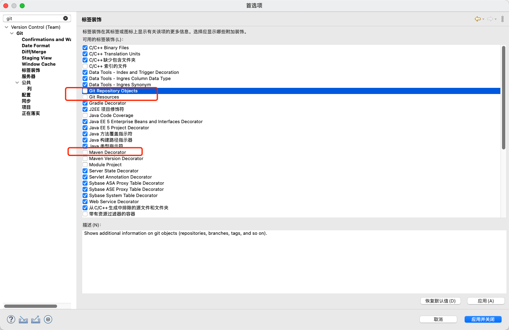
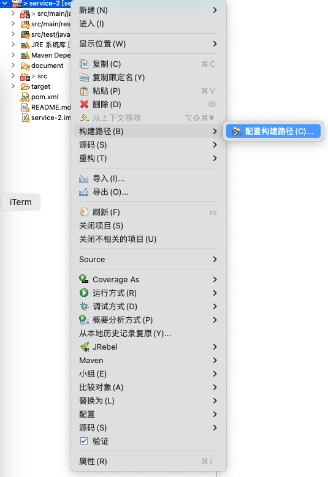

### 设置

##### git

项目资源管理器隐藏分支和图标


##### 项目资源管理器

去掉资源管理器文件上的 M 图标




```
```


### 插件

##### 中文

`Help` -> `Install new software` -> `Add Repository` 

`Name` 输入 `Chinese`

`Location` 输入源地址 `https://download.eclipse.org/technology/babel/update-site/latest/`

勾选 `Babel Language Packs in Chinese (Simplified)`

页面右下角有安装进度

#####

```

```


```
https://weibo.com/ttarticle/p/show?id=2309404478837047034010

https://blog.csdn.net/mng123/article/details/145060870

https://blog.csdn.net/weixin_49543720/article/details/115368349

https://www.cnblogs.com/java-note/p/18615589


https://www.cnblogs.com/Survivalist/p/7944732.html


```

##### 官网插件地址

```
https://marketplace.eclipse.org/
```

##### Vrapper

> vim 插件

```
https://github.com/vrapper/vrapper
```

##### JRebel

```
软件源: https://update.zeroturnaround.com/update-site/
```

##### Lombok

> 

```

```

##### Checkstyle

```
背景：帮助开发人员遵守统一的代码风格规范。它可以检查代码的缩进、命名约定、括号的使用等方面。
示例：如果项目规定方法名采用驼峰命名法，而代码中有不符合此规范的方法名，Checkstyle会标记出来。
细节：可以通过配置文件自定义检查规则，以适应不同项目的代码风格要求。
```

##### FindBugs

```
背景：用于在Java代码中查找潜在的错误。它通过静态分析代码来检测可能出现的空指针异常、资源未关闭等问题。
示例：当代码中有一个方法可能返回null，但没有进行null检查就直接使用时，FindBugs会发出警告。
细节：可以在Eclipse的视图中查看详细的错误报告，并且可以根据错误的严重程度进行排序，方便开发人员优先处理高风险的问题。
```

##### Maven Integration for Eclipse

```
Eclipse 插件中的 M2E 插件或 Maven Integration 是 Java 开发所需的另一个流行 Eclipse 插件。它为 Eclipse 提供全面的 Maven 集成。
```

### 项目设置

```
jdk 版本 Amazon 1.8.0_402


```

##### 项目 jdk 版本


某个项目配置 jdk 版本



##### maven

```
/Users/glfadd/.sdkman/candidates/maven/current
/Users/glfadd/.m2/settings.xml
/Users/glfadd/.m2/repository
```


