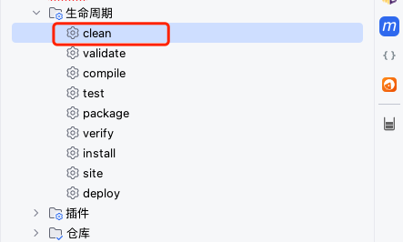

#### 错误

##### maven 设置

```
项目用的 maven 源是哪个?
公司有没有自己私有的?
```

##### 启动错误 1

```
Error starting ApplicationContext. To display the condition evaluation report re-run your application with 'debug' enabled.
```

解决办法

```
application.yaml 添加
debug: true
或
application.properties 添加
debug=true
```

##### 启动错误 2

```
***************************
APPLICATION FAILED TO START
***************************

Description:

Failed to configure a DataSource: 'url' attribute is not specified and no embedded datasource could be configured.

Reason: Failed to determine a suitable driver class


Action:

Consider the following:
	If you want an embedded database (H2, HSQL or Derby), please put it on the classpath.
	If you have database settings to be loaded from a particular profile you may need to activate it (no profiles are currently active).
```

原因

```
DataSourceAutoConfiguration 会自动加载.可以排除此类的自动配置，在启动类中加入
```

解决办法

```
@SpringBootApplication(exclude= {DataSourceAutoConfiguration.class})
```

##### 启动错误 3

##### 启动报错 4

```
java: 程序包******不存在
```



##### 启动报错 5

```
Unable to make field private com.sun.tools.javac.processing.JavacProcessingEnvironment$DiscoveredProcessors com.sun.tools.javac.processing.JavacProcessingEnvironment.discoveredProcs accessible: module jdk.compiler does not "opens com.sun.tools.javac.processing" to unnamed module


JDK 版本太高, 与项目的不对应
```

##### 启动报错 6 

```
对于searchDocuments(java.lang.String,org.elasticsearch.index.query.AbstractQueryBuilder,org.elasticsearch.search.sort.SortBuilder,<nulltype>,int,int,java.lang.Class<java.util.Map>), 找不到合适的方法
```


##### 启动报错 7

```
2024-07-18 09:10:48.576  WARN 2105 --- [           main] org.eclipse.jetty.webapp.WebAppContext   : Failed startup of context o.s.b.w.e.j.JettyEmbeddedWebAppContext@20184ade{application,/,[file:///private/var/folders/y7/n3tz6r194_dd_7hh8dl0vvz80000gn/T/jetty-docbase.6121669311496495461.8084/, jar:file:/Users/glfadd/.m2/repository/io/springfox/springfox-swagger-ui/2.9.2/springfox-swagger-ui-2.9.2.jar!/META-INF/resources],UNAVAILABLE}


删除不可用的 springfox-swagger-ui 包, maven clean 重新构建
```

##### 启动错误 8

```
***************************
APPLICATION FAILED TO START
***************************

Description:

Field xxx in xxxxxController required a bean of type 'xxxxx' that could not be found.


Action:

Consider defining a bean of type 'xxxxx' in your configuration.


添加注释 @Service
public interface A {
}
@Service
public class B implements A {
}
```

##### 启动错误 9

```
/Users/glfadd/Downloads/source/service-3/src/main/java/com/glf/service3/config/SwaggerConfig.java:3:54
java: 无法访问com.github.xiaoymin.knife4j.spring.annotations.EnableKnife4j
  错误的类文件: /Users/glfadd/.m2/repository/com/github/xiaoymin/knife4j-openapi3-jakarta-spring-boot-starter/4.5.0/knife4j-openapi3-jakarta-spring-boot-starter-4.5.0.jar!/com/github/xiaoymin/knife4j/spring/annotations/EnableKnife4j.class
    类文件具有错误的版本 61.0, 应为 55.0
    请删除该文件或确保该文件位于正确的类路径子目录中。
    
```

##### 启动错误 10

```
idea maven 工具提示 "找不到符号"


执行: mvn idea:idea


```

##### 启动错误 11

```
Description:
A component required a bean of type 'cn.gt.sip.service.UpdateDefaultUserServiceV2' that could not be found.

Action:
Consider defining a bean of type 'cn.gt.sip.service.UpdateDefaultUserServiceV2' in your configuration.


解决办法: 添加 @Service 注释
@Service("UpdateDefaultUserServiceV2")
public class UpdateDefaultUserV2Impl implements UpdateDefaultUserServiceV2 {
}
```

##### 启动错误 12

```
new 创建使用 spring 注释修饰的对象, 对象内 @Resource 创建对象都为 null

原因: 使用 spring 修饰的对象不能再使用 new 创建, 必须用 @Resource 创建对象. @Resource 创建对象至少用 @Configuration 修饰.
```

##### 启动错误 13

```
问题:
@Resource 创建的对象每个请求初始化一次成员变量


解决方法:
使用 @RequestScope 或者 @Scope("request")


@Service("UpdateDefaultUserServiceV2")
@RequestScope
public class UpdateDefaultUserV2Impl implements UpdateDefaultUserServiceV2 {
}
```

#####

```
@EnableWebMvc
```


#### 提示

##### 提示 1

```
============================
CONDITIONS EVALUATION REPORT
============================


Positive matches:
-----------------

   AopAutoConfiguration matched:
      - @ConditionalOnProperty (spring.aop.auto=true) matched (OnPropertyCondition)
```

解决办法

```
设置日志级别

logging.level.org.springframework.boot.autoconfigure=INFO 
```

#### SLF4J

##### 启动报错 1

```
SLF4J: Failed to load class "org.slf4j.impl.StaticLoggerBinder".
SLF4J: Defaulting to no-operation (NOP) logger implementation
SLF4J: See http://www.slf4j.org/codes.html#StaticLoggerBinder for further details.
```

解决办法

```
pom 添加依赖

<!-- https://mvnrepository.com/artifact/org.slf4j/slf4j-simple -->
<dependency>
    <groupId>org.slf4j</groupId>
    <artifactId>slf4j-simple</artifactId>
    <version>2.0.9</version>
    <scope>test</scope>
</dependency>
```

##### 启动报错 2

```
SLF4J(W): Class path contains multiple SLF4J providers.
SLF4J(W): Found provider [ch.qos.logback.classic.spi.LogbackServiceProvider@18bf3d14]
SLF4J(W): Found provider [org.apache.logging.slf4j.SLF4JServiceProvider@4fb64261]
SLF4J(W): See https://www.slf4j.org/codes.html#multiple_bindings for an explanation.
SLF4J(I): Actual provider is of type [ch.qos.logback.classic.spi.LogbackServiceProvider@18bf3d14]
```

原因

```
spring boot 默认的 logback 的jar包依赖，和 log4j2 冲突
```

解决办法

```
去掉 spring boot 默认的 logback 的 jar 包依赖
在 spring-boot-starter-web 中排除此依赖不一定有效, 因为可能别的依赖包里也集成了默认的 logback 日志，这样的话项目启动依旧会报冲突
先排除 spring-boot-starter-logging 所有的依赖, 再引入 spring-boot-starter-log4j2, 如果要配置log4j2异步日志, 需要添加disruptor依赖


<dependency>
    <groupId>org.springframework.boot</groupId>
    <artifactId>spring-boot-starter-logging</artifactId>
    <exclusions>
        <exclusion>
            <groupId>*</groupId>
            <artifactId>*</artifactId>
        </exclusion>
    </exclusions>
</dependency>
<dependency>
    <groupId>org.springframework.boot</groupId>
    <artifactId>spring-boot-starter-log4j2</artifactId>
</dependency>
<!-- 如果要配置log4j2异步日志, 需要添加disruptor依赖 -->
<dependency>
    <groupId>com.lmax</groupId>
    <artifactId>disruptor</artifactId>
</dependency>
```

### 数据库

##### 启动报错 1

```
Loading class `com.mysql.jdbc.Driver'. This is deprecated. The new driver class is `com.mysql.cj.jdbc.Driver'. The driver is automatically registered via the SPI and manual loading of the driver class is generally unnecessary.


原因
用最新的 mysql 连接驱动


spring.datasource.driver-class-name=com.mysql.cj.jdbc.Driver
```

##### 启动错误 2

```
Caused by: java.io.FileNotFoundException: class path resource [firstMapper/] cannot be resolved to URL because it does not exist


原因
firstMapper 文件夹下是空白的, 没有 xml 文件


解决办法
firstMapper 文件夹内创建 xml 文件
```

##### 启动错误 3

```
2024-07-02 15:51:19 [RMI TCP Connection(2)-10.133.88.194] WARN  org.springframework.boot.actuate.jdbc.DataSourceHealthIndicator - DataSource health check failed
java.lang.IllegalArgumentException: dataSource or dataSourceClassName or jdbcUrl is required.
```

##### 启动错误 4

```
2024-07-02 15:51:19 [RMI TCP Connection(2)-10.133.88.194] ERROR com.zaxxer.hikari.HikariConfig - HikariPool-1 - dataSource or dataSourceClassName or jdbcUrl is required.


原因


解决办法


```


#####

```
HikariPool-1 - jdbcUrl is required with driverClassName.
```


##### 

```
[WARNING] The artifact mysql:mysql-connector-java:jar:8.0.33 has been relocated to com.mysql:mysql-connector-j:jar:8.0.33
```

